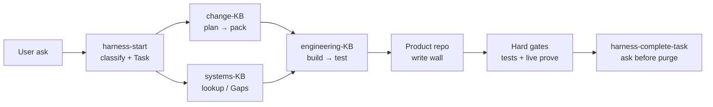

# Harness flow — startup, retrieval, build-to-spec

Sibling to [management-overview.md](./management-overview.md) (the *why*) and [project-summary.md](./project-summary.md) (a real *delivery*). This note traces the **mechanics**: how an agent starts, sources knowledge, and builds to spec under our rules, skills, and role lanes.

---

**1 — Startup (always-on rules + single entry)**

- **Rules load first.** Each repo ships `AGENTS.md` + `.cursor/rules/*-authority.mdc`. These are always in context: retrieve before build, write walls, cite ids, hard gates, thin skills.
- **One door.** Vague or cross-lane work enters via skill `harness-start`. It resumes open Tasks from gitignored `store/`, then **classifies** the ask into lanes — never assuming methods, domain, or engineering.
- **Ephemeral Task.** `harness-task` records intent against `schemas/task.schema.json` into `store/` only — never committed, no `artefacts/` dumps.

**2 — Source knowledge (retrieve before act)**

The agent is forbidden from inventing doctrine in chat. It pulls from the owning vault:

| Lane | Vault | Owns |
| --- | --- | --- |
| Engineering | `engineering-knowledge-base` | Craft, standards, patterns, delivery gates |
| Change (PM/BA/Tester) | `change-knowledge-base` | Project methods, artefact pack, test analysis |
| Systems | `systems-knowledge-base` | Domain systems, SoR, process facts |

Retrieval path inside a vault is index-driven: `README` → `navigation` → family/theme **atlas** → canonical notes. Child notes point at parents; parents point at children — so context is found by traversal, not guessing. Prefer `status: canonical`; a missing vault or silent SoR is a **Gap**, escalated — not fiction.

**3 — Roles (change lane)**

`change-knowledge-base` projects PM/BA/Tester as profiles, each an analysis grain the agent binds to:

- **BA** (BA01–12) — problem framing, requirements, business rules, RTM.
- **PM** (PM01–11) — charter, delivery plan, RAID, decisions, status.
- **TA** (TA01–09) — test conditions, cases, coverage/intent (analysis only — not CI).

**4 — Build to spec (ordered lifecycle skills)**

Each lane exposes thin, invoke-only lifecycle skills that point at vault workflows. The agent runs **one atomic at a time**, gating between lanes:

```text
change:      plan → produce → verify → review
engineering: plan → build   → test   → review
systems:     lookup → plan  → amend  → verify → review
```

- **Write wall.** Product code lands only in the product repo. Vaults and harness are read-only from a delivery session.
- **Hard gates.** Quality claims need real evidence (green `pytest`, live prove) — no soft CI theatre.
- **Cite ids.** Load-bearing choices reference the vault id that justified them.

**5 — End-to-end trace**



**6 — Guardrails (what the flow refuses)**

| Guardrail | Effect |
| --- | --- |
| Retrieve-before-build | No output before the owning vault is read |
| Write walls | Delivery sessions never overwrite sibling vaults |
| Thin skills | Skills route to workflows; never a second bible |
| Gaps over fiction | Missing facts escalate; nothing invented |
| Hard gates | No "done" without passing evidence |
| No `store/` / `artefacts/` in git | Resume state stays ephemeral |

---

**One-liner:** *Rules pin behaviour, `harness-start` classifies and gates, vault indexes feed real knowledge into context, and lane lifecycle skills build to spec inside write walls behind hard gates — control at every step, not freestyle.*
