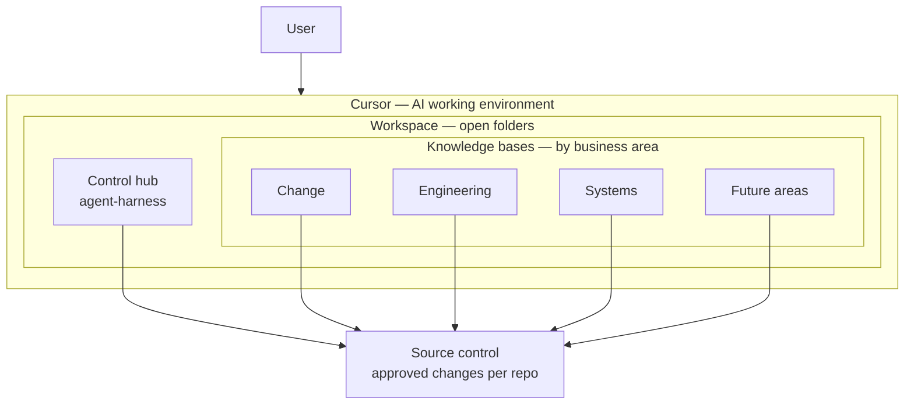
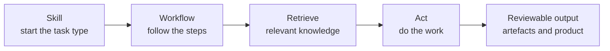

# Cursor agent harness and business knowledge bases

---

**Summary**

We should be using AI to improve productivity and quality of work - but we don't yet have a standardised approach.
We already have staff using AI ad-hoc but essentially no control over processes and context.

This workspace is an example of how to control AI agent processes and context in a structured and scalable way.

Current Issues

- Extremely weak context control - AI context is prompts and a few business docs, lack of specific business knowledge leads to weak outputs
- Extremely weak process control - AI is guided by user only, weak guidance leads to weak outputs

Proposed solution

- Embed system, process, and role knowledge into AI context
- Control AI processes with pre-defined skills and workflows

Outcomes

- Improved AI output quality from real business knowledge embedded in context
- Standardised AI agent workflows following pre-defined processes

---

**Approach**

User runs Cursor in a pre-built workspace.
Repos in that workspace define how the agent works (rules, skills, workflows) and the business knowledge it must use for context.
We keep separate repos so each business unit / knowledge domain can own and control its content.
Changes to workflows and knowledge go through source control with approval gates - same discipline as any other software product.

- Business units own and maintain their knowledge bases via git / DevOps
- Everyone uses the agent-harness; each area gets the knowledge bases it needs
- We lock down changes via standard source control gates

**agent-harness**
Central hub for how agents interact with knowledge.
Rules, skills, and workflows define how the agent approaches a task. This matches the approach Cursor and model providers recommend.
Our harness forces the agent to retrieve knowledge and follow the guidance and processes defined in the knowledge bases.

```text
agent-harness/
  rules/          always-on behaviour
  skills/         how to start a type of task
  workflows/      steps those skills run
```

**knowledge bases**
Bible for specific business unit or knowledge domain.
Documents high level principles through to granular design and process decisions.
Defines role specific workflows for agents to execute.

- Engineering - principles and standards, software and data architecture, code quality, test approach, example code patterns
- Change - PM / BA / Tester role knowledge, standardised project approach, artefact templates
- Systems - systems knowledge, tools, processes, integrations

High-level principles drive lower-level choices.
Indexing strategy - child notes point at the parent that led to them; parents point at their children.
The agent can efficiently search the knowledge base for relevant context via the indexes.

```text
*-knowledge-base/
  maps/           indexes to find topics
  principles/     why
  standards/      the rules
  guidance/       how to apply
  workflows/      domain steps for agents
  examples/       worked examples / templates
```

**Tool/workspace structure**




**Example hierarchy traces**

Example 1 - fail loud config (Python)

Hierarchy:

- Principle (why) - control/config paths have one required path; silent fallbacks are not resilience
- Standard (the rule) - must-have config fails at the gate
- Pattern (how) - validate at startup, not deep in a request
- Example - require env or exit; no silent default

What "good" looks like in code:

```python
import os

def require_env(name: str) -> str:
    value = os.environ.get(name)
    if not value:
        raise SystemExit(f"missing required env: {name}")
    return value
```

What we refuse - defaulting secrets/paths so the service "comes up broken".

Example 2 - problem framing (BA)

Hierarchy:

- Principle (why) - name the problem before listing solutions; two readers should agree what is wrong
- Standard (the rule) - frame must include problem, outcome, in/out/later, risks, warrants, owner
- Guidance (how) - start from pain, refuse solution-only asks, escalate unknowns — do not invent domain lore
- Example - same ask, bad vs good frame

Ask received - “Build a dashboard for invoices.”

Bad (fails the standard):

- Problem - “Need a dashboard” - solution-shaped; nothing named as wrong or missing
- Outcome - “Nice UI” - no beneficiary or better-off-how
- Bounds / warrants - missing - scope unbounded; invented need

Good (same ask):

- Problem - Finance cannot reconcile unpaid invoices older than 30 days without exporting three spreadsheets and joining by hand
- Outcome - Finance ops see aged unpaid invoices in one view and act within month-end without spreadsheet joins
- In / out / later - aged unpaid list + filters + export · out: payment collection, customer portal · later: auto-reminders
- Warrants - Ops lead interview: “~4h at month-end joining CSVs”; escalate systems for invoice source of truth

Point - same ask; good frame is decision-ready.

---

**Agentic workflows**

User prompts agent under a target skill - usually */harness-start* in our case

- Skill - controlled entry-point to start work, triggers sequence of workflows
- Workflow - defined steps for the agent to execute
- Retrieve - pull the relevant business knowledge into context
- Act - complete the task using approved workflows and approved context




---

**Rollout**

This is an example I use outside of work - The domain knowledge is specific to what I do

We would need to populate knowledge bases with significant domain specific knowledge.

However - having thought of that, the knowledge bases define workflows for their own growth and maintenance.
We can run the agent to research from public domain, open-source, textbooks, courses
We can plug in the existing data repos to capture our architecture, standards, schemas
We can provide policy docs, business process documents, 3rd party systems documentation

Engineering and change repos already have significant overlap with our real use cases

All this can be ingensted in a controlled way to get stood up quickly

Suggest rollout to data team first - Zak and Sam as SME - locked down to sandbox vm
Estimate 1-2 weeks to become genuinely integrated into data workflow
Data to own the repos and approval gates in order to enforce quality

Then implement for change team, already have framework for PM/BA/Test - Jim to own change knowledge base, data to gate repos for quality checks
Estimate 2-4 weeks to become genuinely integrated into change workflow

Consider IT/Rolando for systems repo ownership - and consider other business units

---

