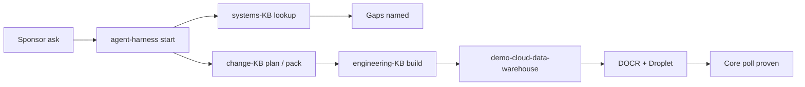

# Example project — OCR cloud data warehouse

Sibling to [management-overview.md](./management-overview.md). That note explains the **harness and knowledge bases**. This note shows what that control plane **actually delivered** on a real demo product.

**Product repo:** `demo-cloud-data-warehouse`  
**Outcome class:** short project (PM / BA / TA methods + engineering + live DigitalOcean deploy)  
**Date:** 2026-07-19

---

**Summary**

We ran one end-to-end demo programme under agent-harness:

- Retrieve domain facts from **systems-knowledge-base** (and record Gaps honestly).
- Plan and govern the change with **change-knowledge-base** methods (thin but complete project pack).
- Build and deploy with **engineering-knowledge-base** patterns (microservices gateway, compose, CI, OpenTofu).

The agent did not invent house doctrine in chat. Where the systems vault had no Zoho / OCR process lore, the project logged Gaps and used sponsor brief + read-only reference repos — exactly the behaviour the harness is meant to force.

**What exists today**

| Layer | Delivered |
| --- | --- |
| Working product | Poll Spaces → OCR images → staging / ODS SCD2 / DWH facts → optional Zoho |
| Cloud runtime | Droplet + managed Postgres + DOCR images via OpenTofu / `deploy.sh` |
| Governance | Thin project artefact pack under `docs/change/` |
| Architecture honesty | Overview, deploy, security posture, domain Gaps |
| Evidence | Unit tests green; core cloud poll proven with Zoho off |

---

**Problem the demo answers**

“Can controlled agents ship a meaningful stack — requirements, pack, code, CI, cloud — without freewheeling domain fiction?”

Yes, with the following shape:

1. **Start** via harness (classify lanes; ephemeral Task; ordered skills).
2. **Domain lookup** before build — DigitalOcean Spaces / managed Postgres from systems-KB; Zoho left as Gap.
3. **Methods plan** — thin project M-set under `docs/change/` (charter through UAT / closure skeletons).
4. **Engineering build** — gateway + bridges + warehouse + CI + OpenTofu, write wall = this product repo only.
5. **Live prove** — sponsor secrets + `deploy.sh`; poll on Droplet.

---

**What the product does**

```text
DigitalOcean Spaces (prefix)
        │ list / get
        ▼
  storage_bridge ──► gateway ◄── ocr_workflow
                       │
         ┌─────────────┼──────────────┬────────────┐
         ▼             ▼              ▼            ▼
     audit_db       ocr_api        dwh_db      zoho_api
   (platform WAL)  (Tesseract)   staging→ODS   (optional
                                  SCD2→DWH      CRM Task)
```

1. Poll a configured Spaces prefix.
2. Stage every listed object (latest folder snapshot).
3. OCR known image types with Tesseract English; skip non-images explicitly.
4. Merge ODS history (SCD2 on row hash); refresh thin DWH facts; log etlcontrol runs.
5. If Zoho is **enabled** with credentials → create a CRM Task (+ optional attachment); if **disabled** → complete without Zoho calls; if enabled without credentials → fail closed.

House patterns reused (read-only pressure): **microservices-framework-simple**, **data-warehouse-main**, **cloud-automation-sandbox**.

---

**Platform and delivery**

| Concern | Approach |
| --- | --- |
| Images | GitHub Actions → DigitalOcean Container Registry (DOCR) |
| Infra | OpenTofu: VPC, Droplet, managed Postgres (MFS-style) |
| Bootstrap | `deploy/terraform/deploy.sh` stages cloud compose + env onto the Droplet |
| Local | Docker Compose with local Postgres for laptop builds |
| Secrets | Injected **per service** — Spaces only on storage-bridge; Zoho OAuth only on zoho-bridge |
| Databases | Logical split: `platform` (gateway WAL) vs `dwh` (warehouse); one managed cluster on cloud |

---

**Project documentation pack**

Living under `demo-cloud-data-warehouse/docs/change/` — thin enough for a demo, complete enough to show the change-methods lane:

| Area | Examples in repo |
| --- | --- |
| Mandate / frame | Initiation charter, problem frame, kickoff, RACI, stakeholders |
| Requirements | Catalogue, quality/RTM, acceptance criteria, NFRs, business rules, data model, Gaps |
| Delivery governance | Delivery plan, RAID, decision log, change control, status |
| Test / UAT | Test plan, conditions, cases, UAT readiness, UAT sign-off, closure |

Architecture companions under `docs/architecture/`:

- **overview** — runtime and pipeline
- **deploy** — CI / OpenTofu / compose map
- **security-posture** — secret isolation findings (security sprint)
- **domain-gaps** — what systems-KB owned vs what stayed Gap

Point of the pack for stakeholders: this is not “AI dumped some markdown.” Artefacts cite change-KB standards/workflows, record decisions (e.g. deploy path, dual logical DBs, Zoho token shape), and keep UAT status honest.

---

**Testing and live evidence**

| Gate | Status |
| --- | --- |
| Unit tests (image filter, row hash, SCD2 decisions) | Pass |
| Repo deploy shape (CI, terraform, cloud compose, env.example) | Pass |
| Droplet health (services up) | Pass |
| Live poll — Spaces → OCR → staging / ODS / facts, Zoho **off** | Pass (proven on prod Droplet) |
| Zoho **on** + fail-closed with bad creds | Deferred for this demo sign-off (Should / follow-up) |
| Formal UAT sign-off sheet | Pack present; sponsor can mark core ACs Pass and Zoho NA |

Core demo story is already runnable end-to-end on cloud. Zoho CRM Task creation remains a Should — intentionally optional so the warehouse path stands alone.

---

**How harness + KBs showed up (trace)**



| Lane | What the agent was allowed to do |
| --- | --- |
| Systems | Use DO Spaces / managed Postgres facts; **not** invent Zoho process |
| Change | Produce thin project pack; track RAID / decisions / Amber status |
| Engineering | Implement only in the product repo; follow gateway / compose / deploy norms |
| Harness | Route lanes; keep ephemeral Task out of git; no second “bible” in harness |

That split is the demo’s management point: **productivity with control**, not chatbot freestyle.

---

**Honest residuals (still useful to say in the room)**

- Zoho deep doctrine remains a systems-KB Gap (P1); demo used sandbox / eng bridge pressure only.
- Formal sign-off rows in `23-uat-sign-off.md` still need sponsor ticks for the core ACs.
- SCD2 “hash changed across runs” and gateway WAL spot-checks are thin follow-ups if audit depth is required.
- Second-order ops lessons (per-service secrets, feature-flag skip vs fail-closed, PYTHONPATH in containers) are candidates to elevate into eng / systems vaults — not dumped as ungoverned chat lore.

---

**Outcomes for the wider programme**

Relative to [management-overview.md](./management-overview.md):

| Claim in the overview | Evidence from this project |
| --- | --- |
| Embed knowledge into AI context | Agents retrieved vault notes / atlases before structural work |
| Control processes with skills / workflows | Start → domain lookup → change plan → eng build → verify |
| Separate ownership via repos | Product write wall; KBs and harness not overwritten from the demo tree |
| Better quality than ad-hoc prompts | Gaps recorded; decisions logged; secret isolation fixed in a named security sprint; live cloud path works |

**One-liner for stakeholders:** *Same harness and knowledge bases that describe how we want agents to work also produced a deployable OCR → warehouse demo on DigitalOcean, with a real project pack and honest Gaps — not a slide-only aspiration.*
